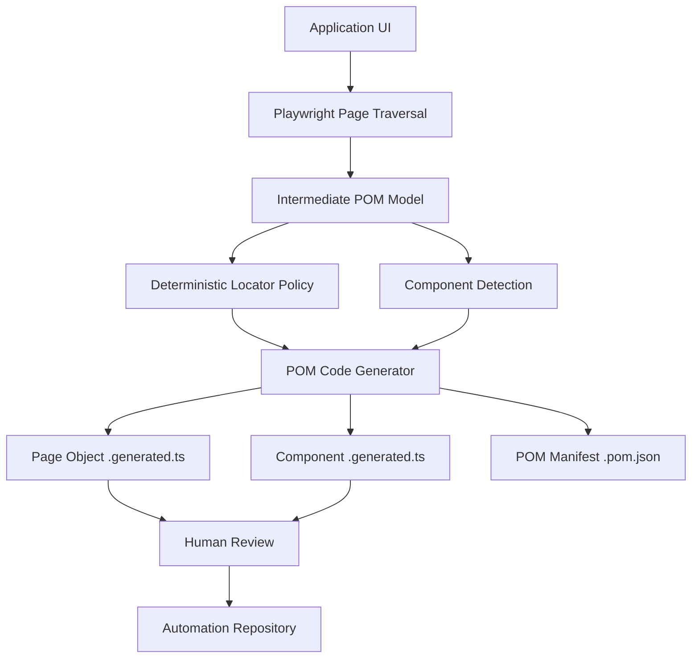

# POM Generator Architecture

```mermaid
flowchart TB
    UI[Application UI] --> D[Playwright Page Traversal]
    D --> M[Intermediate POM Model]
    M --> L[Deterministic Locator Policy]
    M --> C[Component Detection]
    L --> G[POM Code Generator]
    C --> G
    G --> P[Page Object .generated.ts]
    G --> CO[Component .generated.ts]
    G --> J[POM Manifest .pom.json]
    P --> R[Human Review]
    CO --> R
    R --> REPO[Automation Repository]
```

The generator is deliberately non-AI. Its output is deterministic, inspectable, and suitable for CI validation. It never invents business workflows or assertions.
